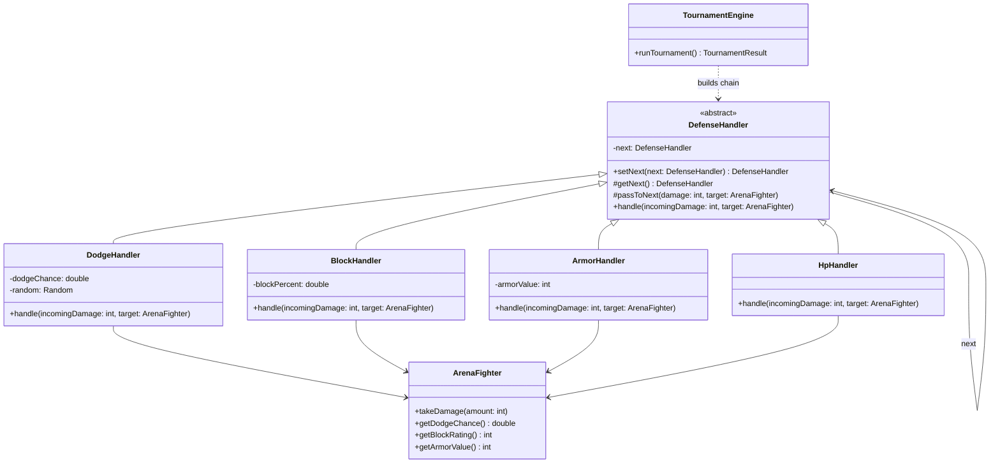

# Chain of Responsibility UML

```mermaid
classDiagram
    class DefenseHandler {
        <<abstract>>
        -next: DefenseHandler
        +setNext(next: DefenseHandler) DefenseHandler
        #getNext() DefenseHandler
        #passToNext(damage: int, target: ArenaFighter)
        +handle(incomingDamage: int, target: ArenaFighter)
    }

    class DodgeHandler {
        -dodgeChance: double
        -random: Random
        +handle(incomingDamage: int, target: ArenaFighter)
    }

    class BlockHandler {
        -blockPercent: double
        +handle(incomingDamage: int, target: ArenaFighter)
    }

    class ArmorHandler {
        -armorValue: int
        +handle(incomingDamage: int, target: ArenaFighter)
    }

    class HpHandler {
        +handle(incomingDamage: int, target: ArenaFighter)
    }

    class ArenaFighter {
        +takeDamage(amount: int)
        +getDodgeChance() double
        +getBlockRating() int
        +getArmorValue() int
    }

    class TournamentEngine {
        +runTournament() TournamentResult
    }

    DefenseHandler <|-- DodgeHandler
    DefenseHandler <|-- BlockHandler
    DefenseHandler <|-- ArmorHandler
    DefenseHandler <|-- HpHandler
    DefenseHandler --> DefenseHandler : next
    DodgeHandler --> ArenaFighter
    BlockHandler --> ArenaFighter
    ArmorHandler --> ArenaFighter
    HpHandler --> ArenaFighter
    TournamentEngine ..> DefenseHandler : builds chain
```
