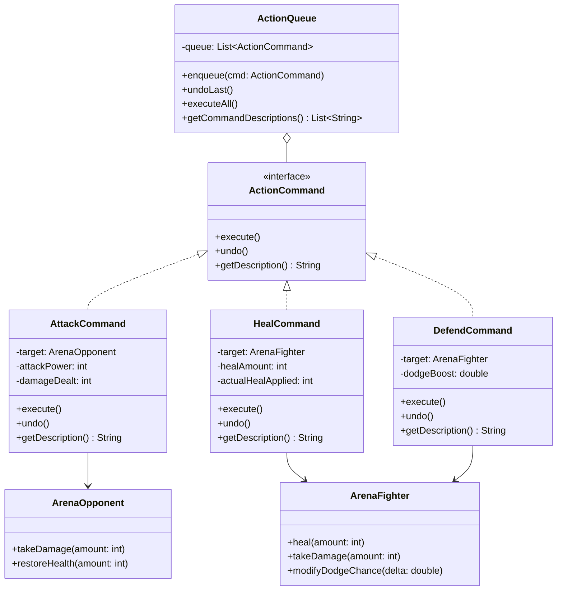

# Command Pattern UML

```mermaid
classDiagram
    class ActionCommand {
        <<interface>>
        +execute()
        +undo()
        +getDescription() String
    }

    class AttackCommand {
        -target: ArenaOpponent
        -attackPower: int
        -damageDealt: int
        +execute()
        +undo()
        +getDescription() String
    }

    class HealCommand {
        -target: ArenaFighter
        -healAmount: int
        -actualHealApplied: int
        +execute()
        +undo()
        +getDescription() String
    }

    class DefendCommand {
        -target: ArenaFighter
        -dodgeBoost: double
        +execute()
        +undo()
        +getDescription() String
    }

    class ActionQueue {
        -queue: List~ActionCommand~
        +enqueue(cmd: ActionCommand)
        +undoLast()
        +executeAll()
        +getCommandDescriptions() List~String~
    }

    class ArenaFighter {
        +heal(amount: int)
        +takeDamage(amount: int)
        +modifyDodgeChance(delta: double)
    }

    class ArenaOpponent {
        +takeDamage(amount: int)
        +restoreHealth(amount: int)
    }

    ActionCommand <|.. AttackCommand
    ActionCommand <|.. HealCommand
    ActionCommand <|.. DefendCommand
    ActionQueue o-- ActionCommand
    AttackCommand --> ArenaOpponent
    HealCommand --> ArenaFighter
    DefendCommand --> ArenaFighter
```
